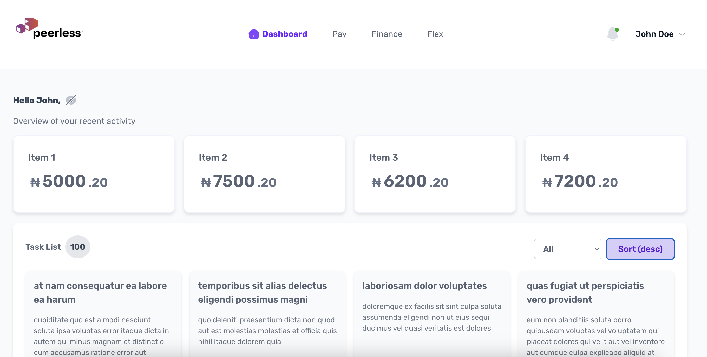

# PeerlessDash



## Overview

PeerlessDash is a task management dashboard that allows users to view, filter, sort, and update task statuses efficiently. The application is built using React and TypeScript, with state management handled via the Context API. The project is designed to provide an intuitive user experience with responsive UI components.

## Live Deployment

This project is deployed at for easy access : [PeerlessDash on Vercel](https://dashboardbuild-jn42.vercel.app/)

## Features

- Fetches tasks from the `TaskContext`
- Displays a list of tasks with filtering and sorting options
- Allows users to update the status of a task
- Shows a modal for task details and updates
- Displays a success modal after status changes
- Responsive design for better accessibility on different screen sizes

## Running the Application

### Prerequisites
- Node.js (v16 or later recommended)
- npm or yarn

### Installation
1. Clone the repository:
   ```sh
   git clone https://github.com/honorableisrael/peerlessdash.git
   cd peerlessdash
   ```
2. Install dependencies:
   ```sh
   npm install
   ```
   Or force installation if necessary:
   ```sh
   npm install --force
   ```

### Development Server
To start the application in development mode:
```sh
npm start
```
This will launch the app at [http://localhost:3000](http://localhost:3000).

### Running Tests
To run tests:
```sh
npm test
```
Test files are located in the `test` folder.

### Building for Production
To generate a production-ready build:
```sh
npm run build
```
The optimized build will be available in the `build` directory.

## State Management
The application utilizes the Context API for global state management.

- `TaskContext`: Manages tasks, loading state, and errors.
- `useTaskContext()`: Provides access to tasks and update functions.

### Example Task Data Structure
```ts
interface Task {
  id: number;
  title: string;
  description: string;
  status: "Pending" | "In Progress" | "Completed";
  dueDate: string;
}
```

## Design Decisions
- Context API: Used for state management due to the size of the project.
- Axios: Chosen for API requests due to better error handling.
- Responsive UI: TailwindCSS and Styled Component used to achieve responsiveness across different screen sizes.
- Testing: Included unit tests for key components to ensure reliability.